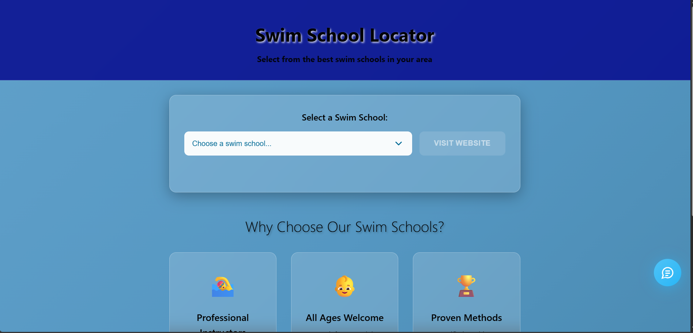
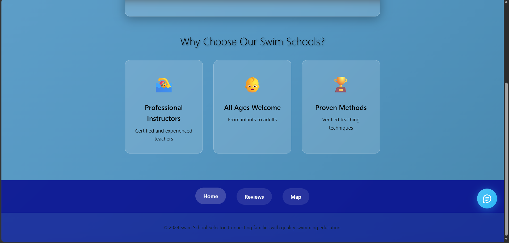
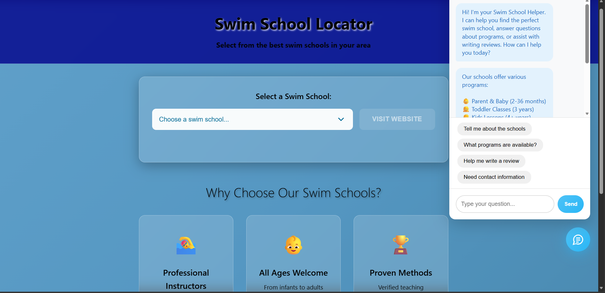
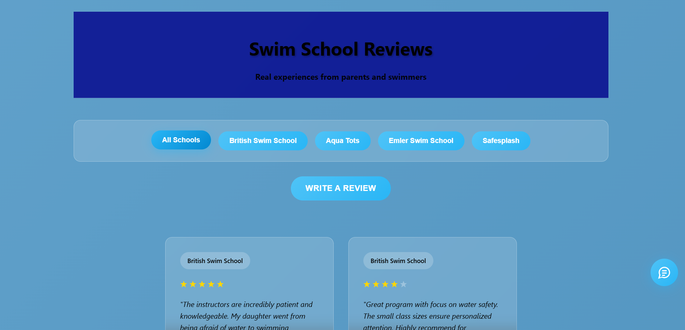
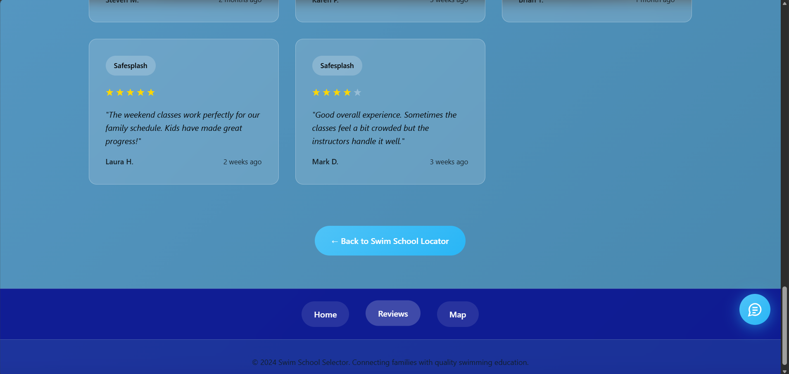
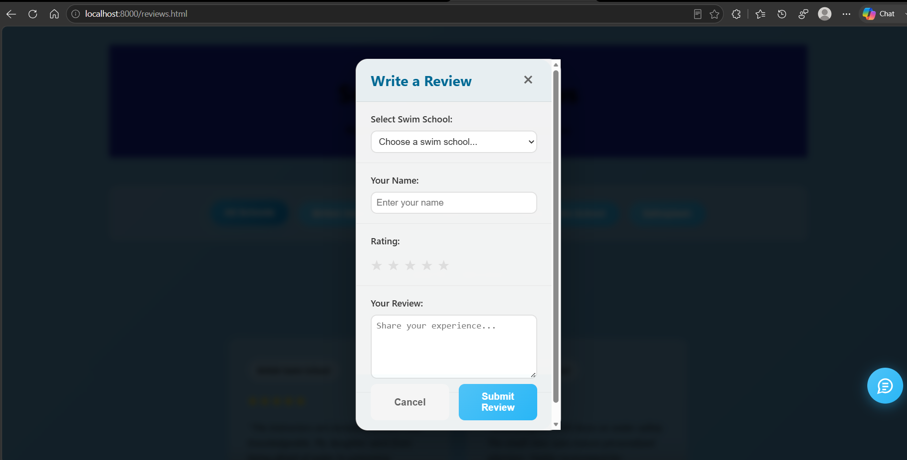
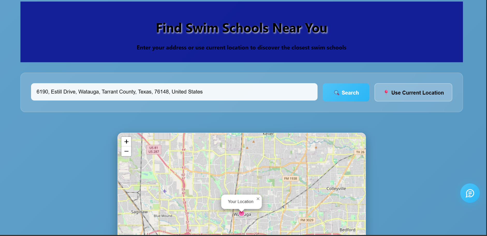

# 🏊 Swim School Locator

A responsive web application that helps families quickly find swim schools, explore locations, read reviews, and receive assistance through an integrated chatbot.

Designed to provide an intuitive user experience, the application makes it easier for parents to compare swimming programs and access important information before enrolling.

---
## Live Demo

🌐 https://cfabish.github.io/swim-school-locator/

## Features

### 🏫 Swim School Directory
- Browse available swim schools
- Select schools from an easy-to-use dropdown
- Visit each school's official website directly

### 🗺️ Interactive Map
- View swim school locations
- Quickly locate nearby schools
- Easy navigation between schools

### ⭐ Customer Reviews
- Read reviews from other parents
- Submit new reviews
- Help families make informed decisions

### 💬 Interactive Chat Assistant

- Custom-built JavaScript chatbot
- Uses event-driven programming to process user interactions
- Provides rule-based responses to common swim school questions
- Assists users with navigating the application and finding information

### 📱 Responsive Design
- Mobile-friendly layout
- Tablet support
- Desktop optimized
- Modern glassmorphism-inspired user interface

---

## Screenshots

### Home Page





### Reviews





### Map



---

## Technologies Used

- HTML5
- CSS3
- JavaScript (ES6)
- DOM Manipulation
- Event-Driven Programming
- Custom Rule-Based Chatbot
- Responsive Web Design

## Project Structure

```
Swim School App/
│
├── index.html        # Home page
├── map.html          # Swim school map
├── reviews.html      # Customer reviews
├── style.css         # Application styling
└── README.md
```

---

## How to Run

### Option 1

Simply open:

```
index.html
```

in your preferred web browser.

### Option 2

Run a local web server:

```bash
python -m http.server 8000
```

Then visit:

```
http://localhost:8000
```

---

## Key Functionality

- Browse swim schools
- Visit school websites
- View location information
- Read customer reviews
- Submit new reviews
- Chatbot assistance
- Responsive navigation

---

## Future Enhancements

Planned improvements include:

- User authentication
- Parent accounts
- Favorite swim schools
- Database-backed reviews
- School ratings
- Advanced search filters
- Google Maps integration
- Admin dashboard
- Appointment scheduling
- Online registration

---

## Project Goals

This project demonstrates:

- Frontend web development
- User interface design
- Responsive layouts
- Interactive web components
- Multi-page website architecture
- User experience design

---

## Author

**Chantal Fabish**

GitHub: https://github.com/cfabish

---

## License

This project is intended for educational and portfolio purposes.